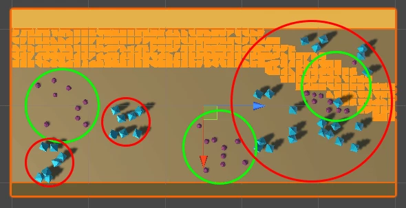
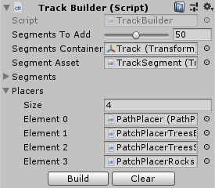
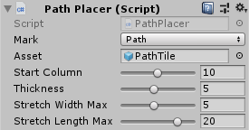
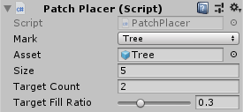

# Taming Randomness

In popular belief:
> "Random generated tracks for race/slider type games are awful and not enjoyable by players and look artificial."

In my belief, with a little bit of creative programming, it can be done quite easily:

<a href="http://www.youtube.com/watch?feature=player_embedded&v=gu4lKvZZD30 
" target="_blank"></a>

## Breakdown

In the above video, a continuous track may be seen with a path and obstacles through which a car is driven. What may not be seen is that the track is actually made from segments of 20x50 world units and that each segment, besides the path tiles, has a big patch of trees, two smaller ones and three patches of rocks, all **randomly** placed.



The main logic is simple: each segment is instantiated one after the other and then passed to a series of placers which randomly put assets in its space. In order to make laying down obstacles easier, an integer matrix (20x50 in this case) is used to represent occupancy status of each segment's space. Placers receive this matrix in order to decide where they can put assets and make marks of their own.

### [Track Builder](Assets/Scripts/TrackBuilder.cs)



Represents the manager for creating and clearing the track. It has two public functions for those purposes, a property specifying how many segments to create, as well as references to the segment prefab and placers.
In the Build function, it simply instantiates each track segment and then calls placers to add assets to it. For memory footprint considerations a single occupancy matrix is used, being cleared after each iteration. The segments are added to a list in order to make the clearing process easier, obviously, in the Clear function.

### [Track Segment](Assets/Scripts/TrackSegment.cs)

Like previously stated, it has a predefined size in world units. Besides the floor, walls and colliders, it also has a game object placed at the end of it. It is used as a marker to get world position for the next segment.
Its script is a simple one, containing the transform reference to the end point marker and a public function used to get a world position. The function receives two integers representing spot coordinates in its space (in the screenshot above 0,0 would be the top left corner and 19,49 would be the bottom right one).
For demo simplicity only one straight segment prefab is used, but expanding the project in order to accommodate curved ones should resort only in adapting getting the world position to reflect the curvature.

### [Placers](Assets/Scripts/Placers)

All of them derive from a base abstract one and do all their logic inside a single function which is invoked by the manager.

```C#
/// <param name="track">Current processed track segment.</param>
/// <param name="spots">Occupancy status of the segment.</param>
public override void Place(Track track, int[,] spots)
```

They all have the following base properties:
* 'mark' - enum type whose integer value will be added to the occupancy matrix in order to show that it is taken
* 'asset' - reference to the prefab object to be instantiated

This project defines two types of placers, but many more may be created in their fashion.

### [Path Placer](Assets/Scripts/Placers/PathPlacer.cs)



Its main responsibility is to make sure that the car always has a clearing in front of it in order to advance. By not having such a placer when generating random levels, it may easily be the case that when adding obstacles an impenetrable wall of them creates a block.
On each build sequence, it starts from a predefined column value. It then iterates on all rows of each track and, by shifting the column's value left and right, it creates the road.
In order to not have a very twitchy random look, it lays the path in consecutive stretches. A [stretch](Assets/Scripts/Placers/PathStretch.cs) is an iterator type structure. It is initialized with a random target width, length and sign (-1 for left, 1 for right). At each row, the placer gets the current shift from the stretch and modifies the current column index. It then marks and creates instances of the asset prefab starting from the current row and column index.

### [Patch Placer](Assets/Scripts/Placers/PatchPlacer.cs)



Its responsibility is to lay down obstacles on the track. It has target patch count and target patch fill ratio because, depending on the size of the patches and empty space availability, not all may be placed, so it gives up.
In order to generate the patches, it scans current segment's occupancy matrix and stores suitable [areas](Assets/Scripts/Placers/PlacerArea.cs) in a list. It picks areas at random from that list until the target count is reached or it still has available areas to pick. A second list, containing the empty spaces from each picked area, is then created. Free [spots](Assets/Scripts/Placers/PlacerSpot.cs) are chosen at random, marked and asset prefab instances created, until the target fill ratio is reached.
Choosing items at random from lists is preferred because the alternative, trying to find a free spot by randomly choosing coordinates and testing if they are free or not, may result in much larger frame times.
After a patch is created, it removes overlapping areas from the initial areas list and repeats the process from the top.

## A more complex implementation

As a 'real world' example, please watch the trailer of one of my personal indie projects:

<a href="http://www.youtube.com/watch?feature=player_embedded&v=kmBHkBkqL3M 
" target="_blank"></a>

## All the best!